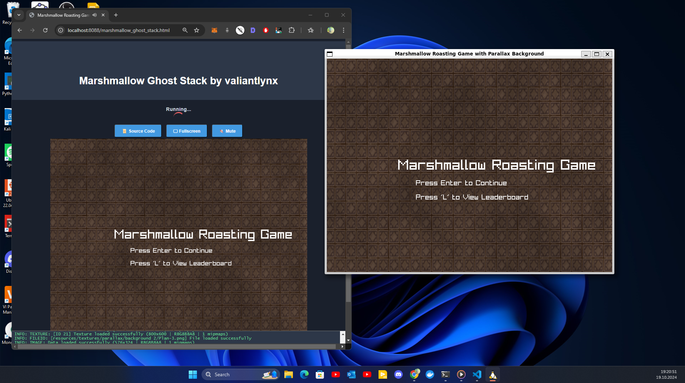

# Marshmallow Ghost Stack: "How to Roast a Marshmallow" Game (Beta UIA Game Jam)
<center>

</center>

[](./marshmallow-podcast.mp4)

**Developed for the Beta UIA Game Jam by valiantlynx**

**Marshmallow Ghost Stack** is a fun web game that challenges you to roast marshmallows to perfection by clicking them at the perfect time, avoiding burning them. The game is inspired by the Ghost Stack game, which is about stacking marshmallows and ice cream sticks as high as possible, adding a playful roasting twist to the theme!

You roast them by clicking at the perfect time not undercooked or burnt

<center>


</center>

## other scrrenshots
see src/resources/screenshots/
e.g


## Requirements

To build and play this game, you'll need:


- **C++ Compiler** (`g++`)
- **Raylib** (for rendering and game development)
- **SQLite3** (for leaderboard functionality)
- **Make** (for building the project)

Raylib is an easy libraly and supports building in multiple ways. use whatever you like

## Building and Running the Game

### 1. Install Raylib

To install Raylib, follow these steps:
Get it form the raylib github repo and follow the instructions there.

I am using linux but the steps are similar for other os as well.
1. Download the Raylib library:


    ```bash
    from github then: 
    tar -xvzf raylib-5.0_linux_amd64.tar.gz
    cd raylib-5.0_linux_amd64/
    ```

2. Copy the necessary files to the system directories:

i needed to do this so that anywhere in the system i could just include the raylib headerfile without thinking of where the path it is installed in is

    ```bash
    sudo cp include/raylib.h /usr/local/include/
    sudo cp include/raymath.h /usr/local/include/
    sudo cp include/rlgl.h /usr/local/include/

    sudo cp libraylib.a /usr/local/lib/
    sudo cp libraylib.so /usr/local/lib/
    ```

3. Install dependencies like SQLite3 and `make`:
sqlite for persistence. make for easier devex

    ```bash
    sudo apt-get install libsqlite3-dev make
    ```

### 2. Build the Game

To compile the game using CMake and the provided Makefile, navigate to the project root directory and run:

```bash
cd src/
make all
```

Alternatively, you can directly compile it with `g++`:

```bash
g++ -o marshmallow_ghost_game marshmallow_ghost_game.cpp -lraylib -lGL -lm -lpthread -ldl -lrt -lX11
```

or with cmake

### 3. Run the Game

After compiling, you can run the game with the following command:

```bash
cd build/linux
./marshmallow_game
```

## compatability
you can compile the game to multiple different systems


## Game Controls

- **Roast the Marshmallows**: Click on the marshmallows when they are perfectly roasted. Be careful not to overcook or undercook them!
- **Game Modes**: There are different difficulty levels and a timed mode to challenge your marshmallow roasting skills.

## Features

- **Responsive Web Game**: The game is also playable in a browser (using WebAssembly). youll have to compile for this though 
- **Leaderboard**: Your best scores are saved and displayed in a leaderboard, powered by SQLite.

## Web Version


The game also has a web version using WebAssembly. You can play it directly in the browser. For running the web version, you need just need to compile for it. the code itself doesnt change. you just need to follow raylibs guide on how to do that: https://github.com/raysan5/raylib/wiki/Working-for-Web-(HTML5)

and when your done serve it however you like. this is some of the logs if done correctly:
```bash
valiantlynx @ kombyoga in ~/.../marshmallow-ghost-stack/src |18:34:16 |c++ U:1 ✗|
$ make -e PLATFORM=PLATFORM_WEB -B
make marshmallow_ghost_stack
make[1]: Entering directory '/home/valiantlynx/projects/marshmallow-ghost-stack/src'
emcc -o marshmallow_ghost_stack.html marshmallow_ghost_stack.cpp -Wall -std=c++11 -D_DEFAULT_SOURCE -Wno-missing-braces -Os -s USE_GLFW=3 -s TOTAL_MEMORY=67108864 --preload-file resources --shell-file /home/valiantlynx/raylib/src/shell.html -DPLATFORM_WEB -s ASYNCIFY -s USE_GLFW=3 -s TOTAL_MEMORY=1073741824 -s ALLOW_MEMORY_GROWTH=1 -s ASSERTIONS=2 -s STACK_OVERFLOW_CHECK=1 -s STACK_SIZE=1024KB -s FORCE_FILESYSTEM -s 'EXPORTED_FUNCTIONS=["_free", "_malloc", "_main"]' -s EXPORTED_RUNTIME_METHODS=ccall --preload-file resources --shell-file /home/valiantlynx/projects/marshmallow-ghost-stack/src/shell.html --preload-file /home/valiantlynx/projects/marshmallow-ghost-stack/src/leaderboard.db@/leaderboard.db -I/home/valiantlynx/sqlite-autoconf-3460100  -I. -I/home/valiantlynx/raylib/src -I/home/valiantlynx/raylib/src/external -L. -L/home/valiantlynx/raylib/src -L/home/valiantlynx/raylib/src /home/valiantlynx/raylib/src/libraylib.a /home/valiantlynx/sqlite-autoconf-3460100/libsqlite3.o -DPLATFORM_WEB
make[1]: Leaving directory '/home/valiantlynx/projects/marshmallow-ghost-stack/src'


valiantlynx @ kombyoga in ~/.../marshmallow-ghost-stack/src/build/web |18:34:27 |c++ U:1 ✗|
$ python3 -m http.server 8088
Serving HTTP on 0.0.0.0 port 8088 (http://0.0.0.0:8088/) ...
127.0.0.1 - - [19/Oct/2024 18:34:33] "GET /marshmallow_ghost_stack.html HTTP/1.1" 200 -
127.0.0.1 - - [19/Oct/2024 18:34:33] "GET /marshmallow_ghost_stack.js HTTP/1.1" 200 -
127.0.0.1 - - [19/Oct/2024 18:34:33] "GET /marshmallow_ghost_stack.data HTTP/1.1" 200 -
127.0.0.1 - - [19/Oct/2024 18:34:34] "GET /marshmallow_ghost_stack.wasm HTTP/1.1" 200 -
127.0.0.1 - - [19/Oct/2024 18:35:00] "GET /marshmallow_ghost_stack.js HTTP/1.1" 304 -
127.0.0.1 - - [19/Oct/2024 18:35:00] "GET /marshmallow_ghost_stack.wasm HTTP/1.1" 304 -
127.0.0.1 - - [19/Oct/2024 18:35:00] "GET /marshmallow_ghost_stack.data HTTP/1.1" 304 -
```


## Development

- **Developer**: valiantlynx
- **Game Jam**: Created for the Beta UIA Game Jam

## License

This project is open-source under the MIT License.

